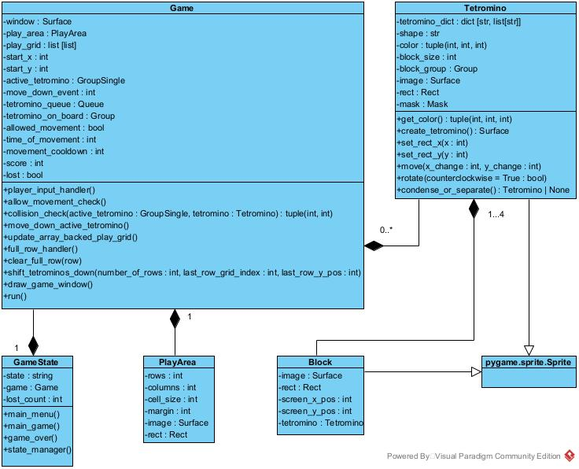
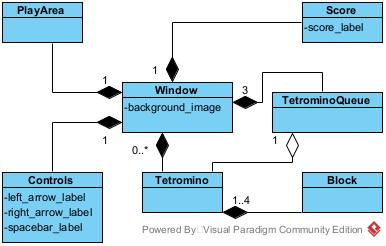

# Tetris Game
### **By Andrew Miller**
___

## Table of contents
* [Summary](#summary)
* [UML Class Diagram](#uml-class-diagram)
* [Graphical Elements Diagram](#graphical-elements-diagram)
* [Technologies](#technologies)
* [Getting Started](#getting-started)
* [Sources](#sources)
* [Contact Info](#contact-info)

___

## Summary

This is a classic tetris game. I created this project to expand my understanding from beyond the basics of Python and the
Pygame library. The goal was to create a tetris game without using a tetris game tutorial.
I wanted to challenge myself to create the program on my own. By creating it on my own, I was able to
gain a deeper understanding of concepts in Python and the Pygame library. 

When I was struggling on a small concept, I would try the Pygame documentation first. If I couldn't find the answers
there then I would do outside research. Any references to a tetris tutorial or Q&A about a tetris game were avoided to
keep the integrity of my goal intact. Overall, I enjoyed the process of creating this game. I even enjoyed the 
frustration and wanting to pull my hair out at times. Most importantly, I learned many concepts
about both python and pygame and expanded my programming knowledge.

___

## UML Class Diagram

___

## Graphical Elements Diagram

This diagram shows the relationships between the different surfaces in the GUI. Also, it helps demonstrate some of the
layers of surfaces. For example, a block is drawn on a tetromino surface. Then, the tetromino can be drawn on the
tetromino queue surface. That tetromino queue surface is drawn on the window. Using surfaces as layers helps organize
the GUI but can cause confusion when it comes to the position of elements in deeper layers. This confusion occurs since
each surface has its own positional data.

___

## Technologies

* Python version: 3.10 and above
* Pygame version: 2.3

___

## Getting started

To run, install Python 3.10 or above by going to https://www.python.org/downloads/.  

For Windows, install the Pygame library by opening a powershell or command prompt and run:

    $ pip install pygame

For Mac, install the Pygame library by opening the terminal and run:

    % pip3 install pygame

The project can then be opened in the IDE of your choice that supports Python.

___

## Sources
The debug file was made by Clear Code https://www.youtube.com/@ClearCode  
Even though the debug file isn't needed for a working version of this game, I wanted to include it as a small tool I used
during the development of this program.

___

## Contact info
Email: ajmiller611@live.com
